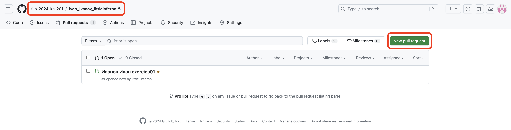
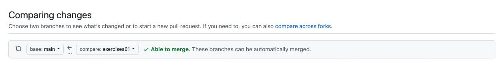

## Выполнения заданий

1. Перейти в ветку для выполнения очередного задания

```bash
git checkout -b exercises01
```

2. После выполнения работы необходимо ее зафиксировать в гите

```bash
git add .
git commit -m "Иванов Иван exercises01"
git push origin exercises01
```

> Вместо "Иванов Иван" должны быть ваши фамилия и имя, а вместо "exercises01" - номер домашки, которую выполнили

3. Далее необходимо создать Pull Request в ветку main вашего репозитория
   1. Перейдите на вкладку Pull Requests вашего репозитория и нажмите на кнопку new Pull Request
        
   2. Поменяйте ветки, чтобы мердж был ***из*** ветки с заданием ***в*** ветку `main`
        
4. Название Pull Request'а должно удовлетворять правилу "<Фамилия> <Имя> exercies<номер задания в две цифры>"
5. Цель выполнения работы - успешное прохождение тестов в github. После этого будет проходить ревью.

> Чтобы преподаватели начали процесс ревью, ***необходимо*** отправить ссылку ваш PR
> в [курс](https://edu.tinkoff.ru/educate/course/9677d4fa-1fc7-48c2-acd1-2081936efe53/overview)

## Получение новых заданий

Новые домашние задания добавляются автоматически из
репозитория [filp-2024/exercises](https://github.com/filp-2024/exercises)
через pull request в ваш репозиторий, который будет смержен автоматически,
если это не произошло, надо призвать [@little-inferno](https://github.com/little-inferno) в pull request.

> Команды ниже надо повторять для каждого обновления

1. Переключаемся на ветку main, т.к. будем обновлять её

```bash
git checkout main
```

2. После этого можно получить изменения

```bash
git pull origin main
```
