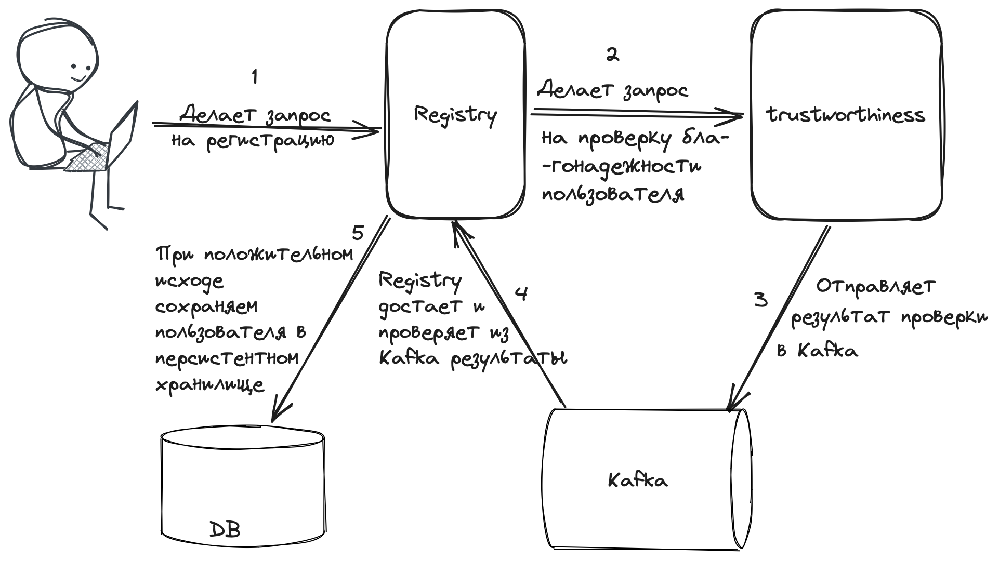

# Registry

Сервис предназначен для регистрации пользователей в
системе. Ключевым моментом этой регистрации является
проверка пользователя на благонадежность. Проверка клиентов
должна происходить через внешний сервис благонадежности (trustworthiness).

## Функциональные требования
- http сервис signIn, по которому будет создаваться заявка на регистрацию
- метод http - POST
- Тело метода
```json
{  
  "name":"Иван",
  "surname":"Иванов",
  "patronymic":"Иванович",
  "passport":"1234567890",
  "phoneNumber":"+79993332220"
}
```
- Поля name, surname, passport, phoneNumber - обязательные, patronymic - опциональное
- Поля name, surname, patronymic(если присутствуют) должны проверяться на содержание
символов русского алфавита.
- Поле passport должно состоять из 10 цифр: первые 4 - серия, последующие 6 - номер
- Поле phoneNumber должно иметь структуру +7\d{3}\d{7}
- Если одно или несколько полей не проходят валидацию, то вернуть 4xx ошибку с пояснениями, где и в каком(их) поле(ях)
есть ошибки
- Если у пользователя есть активная заявка на регистрацию, то вернуть 4хх ошибку с пояснием, что заявка находится в работе
- Если у пользователя уже заведена учетная запись, то вернуть 4хх ошибку с пояснением, что пользователь уже зарегистрирован
в системе
- Если в течение минуты пользователя не удалось зарегистрировать, то попытку считать неудачной и дать пользователю возможность
зарегистрироваться снова
- Авторизации на методе нет

## Не функциональные требования
отсутствуют

## Интеграция с сервисом *trustworthiness*
Интеграция с сервисом trustworthiness имеет следующую схему:
Сначала делается http запрос к сервису, в ответе сервис возвращает requestId.
Результат проверки будет отправлен в топик kafka trustworthiness в формате
```json
{
  "requestId": "1UJKD8O",
  "result": "trust"
}
```
Возможные значения поля result - "trust" и "mistrust"

Время появления записи в топике варьируется от 5 секунд до 1 минуты

## Общая диаграмма взаимодействия


## Задача
1. Закрыть все места с ??? и TODO так, чтобы прошли тесты
2. В MR в несколько предложений написать свое впечатление от
сервиса, которое вы дорабатывали. Есть ли в нем подводные камни?
И если да, то какие? М.б. у вас есть вопросы по общей архитектуре, на которые бы вам
хотелось получить ответ. 

## MISC

Для прохождения воркшопа достаточно добиться прохождения тестов.
Но если вы хотите проверить интеграционную работу сервиса, то можно
воспользоваться сервисом-заглушкой trustworthiness: https://github.com/bondach/trustworthiness
Внутри лежат инстуркции по запуску, у вас должен быть установлен docker

Пример запроса на регистрацию пользователя
```bash
curl -d '{"name":"Иван", "surname":"Иванов", "patronymic":"Иванович", "passport":"1234567890", "phoneNumber":"+79993332220"}' -H "Content-type: application/json"  http://localhost:8080/signUp
```
